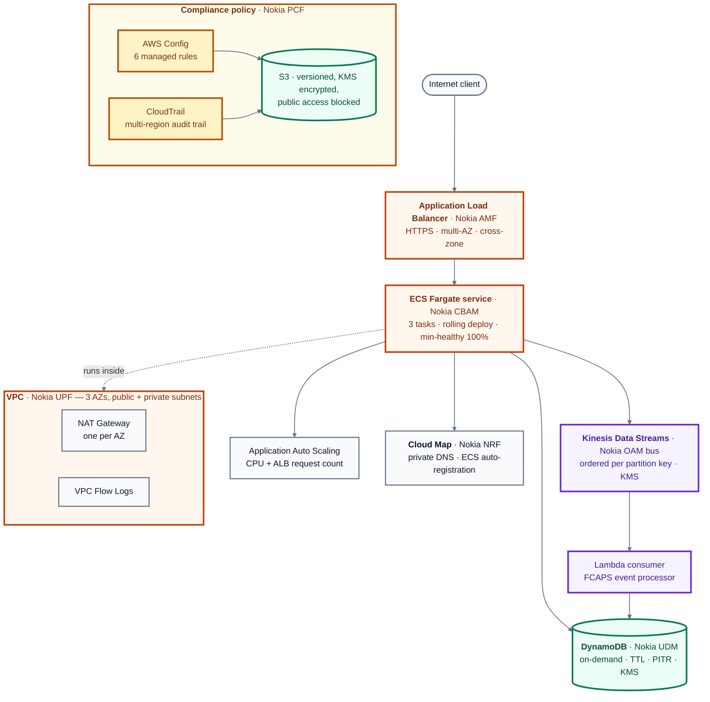

# Nokia 5G Core → AWS Architecture: A Production Migration Case Study

[](https://github.com/sadvi11/nokia-5g-to-aws-migration/actions/workflows/terraform-validate.yml)


> **By Sadhvi** | Cloud & AI Engineer | [GitHub](https://github.com/sadvi11) | Calgary, Canada
>
> *This case study documents how carrier-scale Nokia 5G Core network functions map directly to AWS production architecture — and what that means for designing highly available, low-latency fintech and enterprise cloud systems.*

---

## What is verified, and how

This is an architecture study with working Terraform, not a production
migration — Nokia is not putting their core on AWS, and I could not have done
it if they were. What is real is the source side: I operated these network
functions, so the mapping reflects what they do rather than what their names
suggest.

But a mapping table is a claim. **These are the same claims written so they can
fail**, and they run on every commit with no AWS account and no credentials.

```console
$ terraform plan   # terraform/test — same 7 modules, permissive provider
79 resources across 7 modules
    6  aws_config_config_rule
    6  aws_subnet
    5  aws_iam_role
    3  aws_nat_gateway
    2  aws_security_group
    ...

$ pytest tests/ -v
test_plan_is_not_empty                             PASSED
test_upf_workloads_are_not_internet_addressable    PASSED
test_upf_private_subnets_never_auto_assign_public_ips  PASSED
test_data_plane_spans_multiple_availability_zones  PASSED
test_amf_is_the_only_internet_facing_entry_point   PASSED
test_udm_subscriber_store_is_encrypted_at_rest     PASSED
test_udm_subscriber_store_is_recoverable           PASSED
test_oam_event_stream_is_encrypted                 PASSED
test_nrf_service_discovery_exists_and_is_used      PASSED
test_pcf_policy_enforcement_is_actually_configured PASSED
test_audit_trail_is_enabled                        PASSED
test_every_major_resource_carries_project_tags     PASSED
test_every_core_network_function_is_represented    PASSED
test_mapped_resources_are_a_meaningful_share_of_the_stack  PASSED

14 passed
```

### What each test protects

| 5G function | Property it must keep | Assertion |
|---|---|---|
| **UPF** — user plane | Never directly addressable from outside | ECS tasks have `assign_public_ip: false`; private subnets never auto-assign |
| **AMF** — access management | One controlled entry point | Exactly one security group admits `0.0.0.0/0`, and it is the ALB |
| **UDM** — subscriber data | Encrypted, recoverable | DynamoDB SSE **and** point-in-time recovery *(PCI DSS Req 3)* |
| **OAM** — telemetry | Encrypted; events carry subscriber IDs | Kinesis `encryption_type = KMS` |
| **NRF** — repository | Functions find each other by name | Cloud Map namespace exists **and** every ECS service registers |
| **PCF** — policy | Enforcement, not just observation | Config recorder present **and** ≥4 rules attached |
| — | Survives a facility failure | Subnets span ≥2 availability zones |
| — | Audit evidence exists | CloudTrail enabled, multi-region *(PCI DSS Req 10)* |

**These fail when they should.** Injecting three faults into the plan — public
ECS tasks, DynamoDB encryption off, Kinesis unencrypted — fails exactly the
three corresponding tests and nothing else. A check that cannot fail is worse
than no check, because it produces confidence without coverage.

### Every resource traces back to a network function

All 79 resources carry a `NokiaMapping` tag naming the 5G function they
replace — **35 distinct mappings**, from `UPF-DataPlane` and `AMF-N2-AccessControl`
to `PCF-NetworkGatingRule` and `UDM-SubscriberStore`.

That is what makes this reviewable by someone who knows the carrier side but
not AWS. They can ask *"where did the UPF go?"* and get the answer from the
infrastructure itself rather than from a diagram that may have drifted.

### Why the plan runs in a separate root module

`terraform/test` calls the same seven modules as `environments/prod` through a
provider with `skip_credentials_validation`. The production provider stays
strict — putting that flag on a configuration people might actually apply
turns a wrong-account mistake into a silent one.

`terraform validate` proves the configuration parses. A plan proves the modules
compose, every reference resolves, and these are the resources that would
really be created.

---

## Background

I spent 2.5 years operating Nokia's Cloud-Native 5G Core network functions — AMF, SMF, UPF, CBIS, CBAM, NRF — across 10+ operator deployments serving **Bell Canada** and **T-Mobile US**, at roughly 100,000+ subscribers per deployment. The infrastructure ran as Containerized Network Functions (CNFs) on Kubernetes, against a 99.9% SLA, sub-200ms session setup latency, and zero data-plane disruption during rolling upgrades.

When I transitioned into AWS cloud engineering, I noticed something the resumes never show: **5G Core architecture and AWS production architecture solve the exact same problems.** High availability, horizontal scaling, service discovery, traffic routing, event streaming, container orchestration — they are the same engineering challenges, solved with different tooling.

This document is that mapping, built from real operational experience on both sides.

---

## Architecture

Seven Terraform modules, each replacing one Nokia network function. The mapping
in the table below is what this diagram encodes.



---

## The Core Insight: 5G SBA and AWS Microservices Are the Same Pattern

Nokia 5G Core is a **Service-Based Architecture (SBA)** defined by 3GPP TS 23.501. Every network function (AMF, SMF, UPF, NRF, etc.) exposes REST-style HTTP/2 APIs over a Service-Based Interface (SBI). Functions discover each other through NRF. They scale independently. They communicate asynchronously through event notifications.

This is also exactly how AWS microservices work. The table below is not a rough analogy — it is a precise architectural mapping.

---

## Well-Architected review

Reviewed against the six pillars of the
[AWS Well-Architected Framework](https://docs.aws.amazon.com/wellarchitected/latest/framework/the-pillars-of-the-framework.html),
which is the review a carrier would expect before a migration like this is
approved. **This is a design review of Terraform that has never been applied**,
so every row below describes intent expressed in code, not observed behaviour.

| Pillar | Addressed in the modules | Where it falls short |
|---|---|---|
| **Operational excellence** | Seven self-contained modules, each with its own variables and outputs, so any one can be consumed independently. CloudWatch log groups with explicit retention. VPC flow logs. CI validates and lints every module on each commit. | No deployment has happened, so no operational feedback loop exists. No runbooks, no dashboards, no alarms defined. |
| **Security** | KMS customer-managed keys with aliases. S3 server-side encryption and public access blocks on both the Config and CloudTrail buckets. Multi-region CloudTrail. AWS Config recorder with six managed rules. Security groups scoped per tier. | No WAF, no GuardDuty, no Security Hub — and the architecture diagram no longer claims them. Secrets are passed as variables rather than through Secrets Manager. |
| **Reliability** | Three availability zones with a NAT gateway per AZ, so a zone failure does not remove egress. DynamoDB point-in-time recovery and deletion protection. ECS service with rolling deploys at minimum-healthy 100%. Kinesis ordered per partition key. | **Single region.** No cross-region failover, and no stated RTO or RPO — which for a carrier core would be the first question asked and the first thing to design. |
| **Performance efficiency** | Application Auto Scaling on the ECS service, driven by a predefined metric rather than a fixed schedule. Kinesis partitioned by key so ordering holds per subscriber. DynamoDB on-demand, so throughput follows load rather than a provisioned guess. | No load testing and no benchmark. **The user plane does not map cleanly and is not modelled** — a UPF forwarding subscriber packets at line rate is not an ECS task, and the README says so rather than pretending otherwise. |
| **Cost optimization** | DynamoDB `PAY_PER_REQUEST`, so an idle environment costs almost nothing. TTL on the subscriber table so records expire rather than accumulate. Fargate, so there is no idle node capacity to pay for. | No Savings Plan or Compute Savings modelling, no cost allocation tags, no budget defined. For a workload of this shape that would be a real omission in production. |
| **Sustainability** | On-demand and serverless choices mean capacity tracks demand rather than peak. | **Nothing deliberate.** No Graviton, no region selection by carbon intensity, no measurement. Marking this pillar as addressed would be an unearned claim. |

**The honest summary:** the security and reliability pillars are where a carrier
migration lives, and those are the strongest here. Cost and sustainability are
the weakest. The single-region posture is the largest gap — for a network core
carrying subscriber traffic, multi-region is not an enhancement, it is the
requirement, and this design does not meet it.

---

## The Mapping Table

**This table is a conceptual mapping, not a deployment manifest.** It names the AWS
service that plays each Nokia function's role. Some of those — API Gateway, Cognito,
WAF — are the right conceptual equivalent but are *not* built by this Terraform. What
is actually deployed is exactly what the architecture diagram above shows, and nothing
more.

| Nokia 5G Component | What It Does in 5G | AWS Equivalent | Why the Mapping Is Exact |
|---|---|---|---|
| **AMF** (Access & Mobility Management Function) | First control-plane entry point. Terminates N2 (RAN signaling) and N1 (UE NAS). Manages UE registration, authentication handoff, and mobility. Routes requests to SMF via Nsmf service. | **Application Load Balancer (ALB) + API Gateway** | AMF is the entry point that terminates external connections and routes to internal services. ALB terminates HTTPS at Layer 7 and routes to target groups — same pattern. Both handle authentication delegation (AMF → AUSF; ALB → Cognito/WAF). Both do path-based routing. |
| **SMF** (Session Management Function) | Creates, modifies, and terminates PDU sessions. Selects and controls UPF via N4/PFCP. Enforces QoS policies from PCF. Allocates IP addresses. | **AWS Lambda + Step Functions** | SMF orchestrates session lifecycle — it does not carry traffic itself, it manages the components that do. Lambda is the same: stateless compute that orchestrates downstream services (DynamoDB, S3, other Lambdas). Both are invoked per-session/per-request, not persistent. |
| **UPF** (User Plane Function) | The only data-plane component in 5G Core. Performs GTP-U tunneling, packet forwarding, DPI, NAT, QoS enforcement, and usage reporting. Anchors subscriber sessions during mobility. | **VPC + NAT Gateway + VPC Endpoints** | UPF is the data plane — it moves packets. VPC is the AWS data plane — it moves network traffic. NAT Gateway performs address translation (UPF does CGNAT). VPC Endpoints handle private traffic routing. Both are performance-critical and scale independently of the control plane. |
| **CBIS** (Cloud Base Infrastructure System) | Nokia's OpenStack-based infrastructure management layer. Manages physical compute, storage, and networking resources. Provides the IaaS layer on which CNFs run. | **EC2 + EBS + VPC** | CBIS is bare-metal IaaS for 5G CNFs. EC2+EBS+VPC is IaaS for cloud workloads. Same layer: raw compute, storage, networking that higher-level orchestration sits on top of. |
| **CBAM** (Cloud Band Application Manager) | Nokia's CNF lifecycle manager. Handles onboarding, instantiation, scaling, healing, and termination of Containerized Network Functions on Kubernetes. ETSI MANO compliant. | **Amazon EKS + ECS Fargate** | CBAM manages container lifecycle at carrier scale. EKS/ECS Fargate manages container lifecycle for cloud workloads. Same responsibility: deploy, scale, heal, terminate containers. CBAM uses Kubernetes under the hood — EKS is managed Kubernetes. |
| **NRF** (Network Repository Function) | Central service registry for the 5G Core SBA. All NF instances register their profiles (NF type, address, capacity, services). Consumers query NRF to discover producers via Nnrf_NFDiscovery service. | **AWS Service Discovery (Route 53 + Cloud Map)** | NRF is service discovery for 5G. Cloud Map is service discovery for AWS. Both maintain a registry of healthy service instances. Both support health-check-based deregistration. Both are queried at runtime by consumers before making service calls. |
| **OAM Event Bus** (Operations, Administration, Maintenance) | Distributed event bus connecting all Nokia NFs. Carries fault, configuration, accounting, and performance management events. Decouples producers (NFs generating alarms) from consumers (management systems). | **Amazon Kinesis Data Streams + EventBridge** | The OAM event bus is an event streaming layer. Kinesis is AWS's high-throughput event streaming layer. Both decouple event producers from consumers. Both handle high-volume, ordered, persistent streams of operational events. EventBridge maps to the routing/filtering layer of OAM. |
| **UDM** (Unified Data Management) | Stores subscriber profiles, authentication credentials, slice entitlements, and session context. Provides Nudm services to AMF (authentication) and SMF (subscription data). | **Amazon DynamoDB + ElastiCache** | UDM is the subscriber database — high-read, structured, must survive NF failures. DynamoDB is the AWS equivalent: managed NoSQL with single-digit millisecond reads, high availability, and no single point of failure. ElastiCache maps to UDM's in-memory session context. |
| **Network Slicing (NSSF + end-to-end)** | Creates isolated virtual networks on shared physical infrastructure. Each slice has dedicated resource quotas, QoS policies, and SLA guarantees. Used to separate eMBB, URLLC, and mMTC traffic. | **VPC per environment + IAM boundaries + resource tagging** | Network slicing = logical isolation on shared infrastructure. AWS VPCs provide the same: isolated network boundaries on shared AWS infrastructure. IAM SCPs enforce resource boundaries across slices/accounts. Resource tagging enables per-slice cost tracking — same as per-slice charging in 5G. |
| **PCF** (Policy Control Function) | Provides unified policy framework. Delivers PCC rules (QoS parameters, gating, charging triggers) to SMF. Interfaces with UDR for subscriber-specific policy data. | **AWS Config + IAM Policies + WAF** | PCF enforces runtime policies on sessions. AWS Config enforces runtime compliance policies on resources. Both detect policy violations and trigger remediation. IAM policies control access (PCF controls session access). WAF enforces traffic policies (PCF enforces QoS/gating). |

---

## Deep Dive: AMF → ALB (The Entry Point Pattern)

### In Nokia 5G

The AMF is the first 5G Core component a UE's signaling reaches after the gNodeB (base station). It:

- Terminates **N2 interface** (NGAP protocol) from RAN
- Terminates **N1 interface** (NAS protocol) from UE
- Authenticates the UE via AUSF/UDM (delegates, does not perform auth itself)
- Routes PDU session requests to the appropriate SMF
- Manages mobility — when a UE moves between base stations, AMF coordinates the handover without dropping the session

Nokia runs AMF in **active-active pools**. On the deployments I worked on, we ran AMF pools of 3–4 instances per region with N+1 redundancy. If one AMF pod fails, in-flight NAS procedures are redistributed across the pool. Subscriber context is stored in UDM, not the AMF pod, so the failover is stateless.

**Carrier-grade requirement: AMF failure must not drop any active subscriber session.**

### In AWS

The Application Load Balancer implements the same pattern:

- Terminates **HTTPS** (Layer 7) from clients
- Delegates authentication to **Amazon Cognito** or forwards auth headers to backend — does not authenticate itself
- Routes requests to target groups based on path, host header, or query params — same as AMF routing to different SMFs based on DNN/NSSAI
- Operates across **multiple Availability Zones** in active-active mode — same as AMF pools across Nokia cloud zones
- If one ALB node fails, Route 53 and the ALB control plane redistribute traffic — no dropped connections for clients

```
Nokia 5G                          AWS
--------                          ---
gNB (base station)                Client (browser / mobile app)
     |                                 |
     | N2/NGAP                         | HTTPS
     v                                 v
  AMF Pool                         ALB (multi-AZ)
  (active-active,                  (active-active,
   N+1 redundancy)                  cross-zone enabled)
     |                                 |
     | Nsmf service call               | Target group routing
     v                                 v
  SMF instances                    ECS/Lambda services
```

**The architectural lesson:** Entry points must be stateless, highly available, and delegate authentication. Whether it is NGAP termination or HTTPS termination, the pattern is identical.

---

## Deep Dive: CBAM → EKS (The Container Orchestration Pattern)

### In Nokia 5G

CBAM (Cloud Band Application Manager) is Nokia's ETSI MANO-compliant CNF lifecycle manager. My day-to-day work included:

- **Onboarding** CNF packages (AMF, SMF, UPF, NRF as Helm charts) into CBAM's catalog
- **Instantiating** CNFs onto specific Kubernetes namespaces with resource quotas
- **Scaling** — horizontal pod autoscaling for SMF based on PDU session rate; vertical scaling for UPF based on throughput
- **Healing** — CBAM detected pod crashes (via Kubernetes liveness probes) and automatically re-instantiated failed pods
- **Rolling upgrades** — zero-downtime upgrades using Kubernetes rolling deployment strategy, with CBAM coordinating the upgrade sequence across interdependent NFs

We operated 5+ CNFs per deployment (AMF, SMF, UPF, NRF, PCF) on a shared Kubernetes cluster (CBIS-managed), across 3 cloud zones for redundancy.

**The hardest operational challenge:** Upgrading UPF without dropping in-flight subscriber user-plane sessions. Solution: graceful session drain via SMF N4 interface before pod termination.

### In AWS

Amazon EKS implements the same operational model:

- **Helm charts** → same tooling, same packaging format
- **Namespace isolation with resource quotas** → same Kubernetes primitives
- **Horizontal Pod Autoscaler (HPA)** → same as CBAM's scaling policies
- **Kubernetes liveness/readiness probes** → same health check mechanism CBAM used
- **Rolling updates with `maxUnavailable: 0`** → same zero-downtime upgrade pattern
- **Pre-stop hooks** → equivalent to the graceful session drain we implemented for UPF

```yaml
# This EKS deployment spec mirrors what CBAM generated for SMF pods
apiVersion: apps/v1
kind: Deployment
metadata:
  name: payment-service          # Maps to: SMF instance
spec:
  replicas: 3                    # Maps to: SMF pool size (N+1)
  strategy:
    type: RollingUpdate
    rollingUpdate:
      maxUnavailable: 0          # Maps to: zero session drop during upgrade
      maxSurge: 1
  template:
    spec:
      containers:
      - name: payment-service
        livenessProbe:           # Maps to: CBAM health monitoring
          httpGet:
            path: /health
            port: 8080
          initialDelaySeconds: 30
          periodSeconds: 10
        lifecycle:
          preStop:               # Maps to: graceful session drain before UPF termination
            exec:
              command: ["/bin/sh", "-c", "sleep 15"]
        resources:
          requests:
            memory: "256Mi"      # Maps to: CBAM resource quota per CNF instance
            cpu: "250m"
          limits:
            memory: "512Mi"
            cpu: "500m"
```

**The architectural lesson:** Container orchestration at carrier scale and at AWS scale are the same engineering problem. The tooling (CBAM vs EKS) differs, but the operational concepts — pod lifecycle, resource quotas, rolling upgrades, health probes, graceful termination — are identical.

---

## Deep Dive: OAM Event Bus → Kinesis (The Event Streaming Pattern)

### In Nokia 5G

Every Nokia NF generates operational events: alarms, configuration changes, performance counters, charging data records. These flow through the OAM (Operations, Administration & Maintenance) event bus to management systems (NetAct, Nokia Network Operations Center).

Key properties of the Nokia OAM event bus:
- **Decoupled**: NFs publish events without knowing which management system consumes them
- **Ordered**: Events within a subscriber context arrive in sequence (critical for charging — a "session start" event must precede "session stop")
- **Persistent**: Events are retained long enough for management systems to catch up after a restart
- **High throughput**: At 100,000+ subscribers per deployment, a busy UPF generates millions of usage report events per hour

### In AWS: Kinesis Data Streams

```python
# This boto3 pattern mirrors how Nokia NFs published OAM events
# Real code from aws-python-automation project (github.com/sadvi11)

import boto3
import json

kinesis = boto3.client('kinesis', region_name='ca-central-1')

def publish_session_event(subscriber_id: str, event_type: str, event_data: dict):
    """
    Publish a subscriber session event to Kinesis.
    
    Nokia equivalent: UPF publishing Usage Report to OAM event bus via N4 interface.
    Partition key = subscriber_id ensures all events for one subscriber
    land on the same shard — preserving event order (same as Nokia's
    per-subscriber event ordering guarantee).
    """
    event = {
        "subscriber_id": subscriber_id,
        "event_type": event_type,     # SESSION_START, SESSION_END, USAGE_REPORT
        "timestamp": "2025-01-01T00:00:00Z",
        "data": event_data
    }
    
    response = kinesis.put_record(
        StreamName='subscriber-events',
        Data=json.dumps(event),
        PartitionKey=subscriber_id    # CRITICAL: same shard = ordered delivery
                                      # Nokia equivalent: per-UE event sequence numbers
    )
    return response

# Consumer side: Lambda processing events in order
# Nokia equivalent: NetAct (management system) consuming from OAM event bus
def process_session_event(event, context):
    for record in event['Records']:
        payload = json.loads(record['kinesis']['data'])
        if payload['event_type'] == 'SESSION_END':
            # Trigger charging calculation
            # Nokia equivalent: CHF (Charging Function) consuming usage data from UPF
            calculate_and_record_charge(payload)
```

**The architectural lesson:** Operational event buses require ordering guarantees per entity (subscriber/user/transaction), high throughput, and consumer decoupling. Kinesis partition keys solve the ordering problem the same way Nokia's per-subscriber event sequencing does.

---

## High Availability: What Carrier Scale Taught Me About AWS Design

Operating Nokia 5G Core for Bell Canada and T-Mobile US against contractual 99.9% SLAs (8.76 hours of downtime per year maximum) taught me HA patterns that apply directly to AWS:

### Pattern 1: Stateless Control Plane, Persistent Data Plane

In 5G, AMF and SMF pods are stateless. Subscriber context lives in UDM. If an AMF pod dies, the replacement pod reads subscriber context from UDM — no session dropped.

**AWS translation:** Lambda functions (control plane) must be stateless. State lives in DynamoDB (UDM equivalent). Never store session context in Lambda memory.

### Pattern 2: N+1 Redundancy, Not 2N

Nokia runs AMF pools at N+1, not 2N (active-standby). Active-standby wastes 50% capacity and introduces failover delay. Active-active N+1 absorbs one failure instantly with no switchover.

**AWS translation:** Run minimum 3 instances across 3 AZs, not 2 in active-standby. ALB cross-zone load balancing achieves the same active-active distribution.

### Pattern 3: Graceful Degradation, Not Hard Failure

Nokia UPF never drops in-flight sessions on upgrade. SMF signals UPF to drain sessions gracefully before the pod receives SIGTERM.

**AWS translation:** ALB connection draining (deregistration delay = 30s) + ECS task `stopTimeout` = same graceful drain. Configure `deregistrationDelay.timeout_seconds` to match your P95 request latency.

### Pattern 4: Isolation Boundaries Prevent Blast Radius

Nokia network slicing isolates eMBB (high-throughput mobile broadband) from URLLC (ultra-reliable low-latency, used for industrial automation) on shared infrastructure. A traffic spike in one slice cannot starve another.

**AWS translation:** Separate VPCs per environment (dev/staging/prod). Resource quotas per ECS service. Reserved concurrency on Lambda for critical paths. Same blast-radius containment.

---

## Scale Context: What "Carrier Grade" Means in Numbers

| Metric | Nokia 5G (per operator deployment) | AWS Equivalent Pattern |
|---|---|---|
| Active subscribers | 100,000+ per deployment | 100,000+ concurrent users |
| Concurrent PDU sessions | ~1 per active subscriber, plus a second for VoNR/IMS — so the same order of magnitude as the subscriber count | Concurrent Lambda invocations scale with active users, not with registered ones |
| Data-plane throughput | Scales independently of the control plane — UPF instances are added for capacity without touching AMF/SMF | VPC and NAT bandwidth scale separately from Lambda concurrency |
| AMF registration rate | 100,000+ UEs/hour | 100,000+ ALB requests/minute |
| Session setup latency | <200ms end-to-end | <200ms API Gateway + Lambda P95 |
| Upgrade downtime | 0 (zero-downtime rolling) | 0 (ECS rolling deployment, `maxUnavailable: 0`) |
| Redundancy model | N+1 active-active across 3 zones | Multi-AZ, min 3 AZs, cross-zone LB enabled |

> **On the numbers:** subscriber counts, registration rate and latency targets are the
> figures the deployments were dimensioned against. Session concurrency is stated as a
> ratio rather than an absolute, because it follows from the subscriber count rather than
> standing on its own. Where a figure would be a platform specification rather than
> something I measured, the row describes the scaling property instead — the architectural
> point here is *how* each tier scales, and a precise number I could not defend would add
> nothing to it.

---

## Fintech Application: Why This Matters for TNG / Mortgage Processing

Mortgage processing platforms face the same constraints Nokia's 5G Core was designed to solve:

**High availability requirement:** A mortgage transaction cannot fail mid-way — same as a 5G PDU session cannot drop during a handover. Solution: stateless services + persistent state store (DynamoDB) + ALB connection draining.

**Compliance-driven isolation:** PCI DSS requires payment card data to be isolated from other systems — same architectural pattern as 5G network slicing. Solution: dedicated VPC with private subnets, no internet gateway on data-tier subnets, VPC endpoints for AWS service calls.

**Audit trail requirement:** SOC 2 and PCI DSS require complete audit logs of all system events — same as 5G's CDR (Charging Data Record) requirement. Solution: CloudTrail + Kinesis + S3 for immutable event log, same pattern as UPF usage reporting to CHF.

**Zero-downtime deployments:** Mortgage origination systems cannot take maintenance windows during business hours — same SLA as 5G Core. Solution: ECS rolling deployments with `maxUnavailable: 0` + ALB deregistration delay, same pattern as CBAM-managed CNF upgrades.

---

## Run it

All seven modules are wired together in `terraform/environments/prod`. Every
variable has a default, so `plan` works with no configuration.

**Prerequisites:** Terraform >= 1.5, AWS CLI configured with credentials.

```bash
git clone https://github.com/sadvi11/nokia-5g-to-aws-migration.git
cd nokia-5g-to-aws-migration/terraform/environments/prod

# Validate without credentials or state — this is what CI runs
terraform init -backend=false
terraform validate
terraform fmt -check -recursive

# See what would be created (needs AWS credentials, creates nothing)
terraform init
terraform plan
```

> ### ⚠️ Applying this costs real money
>
> This is a production-shaped stack, not a free-tier demo. `terraform apply`
> provisions, among other things:
>
> | Resource | Why it costs |
> |---|---|
> | **3 × NAT Gateway** (one per AZ) | ~$0.045/hour each, billed whether or not traffic flows — the largest line item by far |
> | **Application Load Balancer** | Hourly charge plus LCU |
> | **ECS Fargate** (3 tasks) | Per vCPU-second and GB-second |
> | **Kinesis Data Streams** | Per shard-hour |
> | **AWS Config** (6 rules) | Per configuration item recorded |
> | **CloudTrail** (multi-region) | Per event delivered beyond the free tier |
>
> Expect this to run into the **low hundreds of dollars per month** if left
> running. Verify against the [AWS pricing calculator](https://calculator.aws)
> for `ca-central-1` before applying.
>
> The per-AZ NAT gateway is deliberate — it is the N+1 redundancy pattern
> described below, and collapsing to a single shared NAT would cut cost by
> roughly two-thirds at the price of an AZ-level single point of failure. That
> trade-off is the point of the design, not an oversight.
>
> **Tear down when you are done:**
>
> ```bash
> terraform destroy
> ```

### The modules

| # | Module | Nokia equivalent | Provisions |
|---|---|---|---|
| 01 | `vpc-data-plane` | UPF (User Plane Function) | VPC across 3 AZs, public/private subnets, per-AZ NAT, flow logs |
| 02 | `alb-entry-point` | AMF (Access & Mobility Management) | Application Load Balancer, target groups, listeners |
| 03 | `ecs-container-orchestration` | CBAM (CNF lifecycle manager) | ECS Fargate service, task definitions, application auto-scaling |
| 04 | `kinesis-event-bus` | OAM event bus | Kinesis Data Streams, KMS encryption, Lambda consumer |
| 05 | `dynamodb-subscriber-store` | UDM (Unified Data Management) | DynamoDB with on-demand billing, TTL, point-in-time recovery |
| 06 | `service-discovery` | NRF (NF Repository Function) | Cloud Map private DNS namespace, ECS auto-registration |
| 07 | `compliance-policy` | PCF (Policy Control Function) | 6 AWS Config rules, CloudTrail, encrypted S3 delivery |

Each module is self-contained with its own `variables.tf` and `outputs.tf`, so
any one can be consumed independently of the others.

---

## Related Projects

This case study is backed by working code:

| Project | Description | Link |
|---|---|---|
| `aws-vpc-terraform` | Production VPC modelled on Nokia 5G zone architecture: public/private subnets, NAT Gateway, IAM, Security Groups | [GitHub](https://github.com/sadvi11/aws-vpc-terraform) |
| `bedrock-rag-app` | RAG pipeline on AWS Bedrock: Titan Embeddings V2 + Claude Haiku + pgvector. Live at bedrock-rag-app.onrender.com | [GitHub](https://github.com/sadvi11/bedrock-rag-app) |
| `f1-telemetry-pipeline` | Real-time event streaming: SQS + Lambda + DynamoDB. Same pattern as Nokia OAM event bus | [GitHub](https://github.com/sadvi11/f1-telemetry-pipeline) |
| `aws-python-automation` | boto3 automation: EC2, S3, Lambda, CloudWatch, SNS | [GitHub](https://github.com/sadvi11/aws-python-automation) |

---

## Sources

All Nokia 5G architecture claims in this document are grounded in:

- 3GPP TS 23.501 (System Architecture for the 5G System) — the normative spec for AMF, SMF, UPF, NRF, and SBA
- Nokia Cloud Packet Core official documentation: https://www.nokia.com/core-networks/cloud-packet-core/
- Nokia CBAM/CBIS operational experience (2021–2024)
- AWS official documentation: Application Load Balancer, Amazon EKS, Amazon Kinesis, Amazon VPC
- AWS Prescriptive Guidance: Choosing the right service for microservice endpoints

---

*Sadhvi — AI Cloud Engineer | Nokia 5G → AWS | Calgary, AB*  
*GitHub: github.com/sadvi11*

📐 [View full architecture diagram](diagrams/ARCHITECTURE.md)
