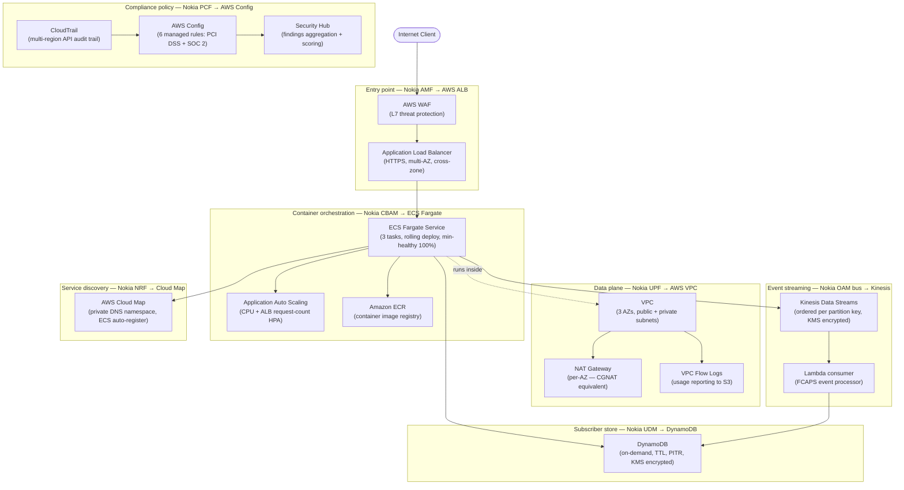

# Architecture Diagram: Nokia 5G Core → AWS

GitHub renders Mermaid diagrams natively. The diagram below shows every Nokia 5G network function mapped to its AWS equivalent, connected with accurate service relationships.

---

## Full architecture

---

## Component mapping legend

| Subgraph colour | Nokia component | AWS service | Why the mapping is exact |
|---|---|---|---|
| Entry | AMF — first control-plane entry, auth delegation, routing | ALB + WAF | Both terminate external connections at L7, delegate auth, route to internal services |
| Data plane | UPF — packet forwarding, CGNAT, QoS enforcement | VPC + NAT Gateway + Flow Logs | Both are the data-plane layer: routing, address translation, traffic logging |
| Orchestration | CBAM — CNF lifecycle (deploy, scale, heal, upgrade) | ECS Fargate + Auto Scaling + ECR | Both manage container lifecycle: rolling deploys, HPA, health-check-driven healing |
| Event streaming | OAM event bus — FCAPS events, ordered per subscriber | Kinesis Data Streams + Lambda | Both provide ordered, persistent, high-throughput event streaming with consumer decoupling |
| Subscriber store | UDM — subscriber profiles, session context, auth data | DynamoDB | Both: low-latency reads, HA, stateless NFs/tasks read context from here on restart |
| Service discovery | NRF — NF registration + discovery via Nnrf API | AWS Cloud Map | Both: central registry, health-check-driven deregistration, DNS-based discovery |
| Compliance policy | PCF — PCC rules, gating decisions, policy enforcement | AWS Config + CloudTrail + Security Hub | Both enforce runtime compliance rules across all components and log violations |

---

## Data flow: request lifecycle

1. **Client → WAF** — L7 inspection, block malicious requests (Nokia: SEPP security edge equivalent)
2. **WAF → ALB** — HTTPS termination, auth delegation (Nokia: AMF N2 termination)
3. **ALB → ECS Fargate** — path-based routing to healthy task (Nokia: AMF → SMF routing)
4. **ECS → DynamoDB** — read/write session state (Nokia: SMF → UDM subscriber data)
5. **ECS → Kinesis** — publish operational events (Nokia: UPF/SMF → OAM event bus)
6. **Kinesis → Lambda** — consume and process FCAPS events (Nokia: CHF/NetAct consuming OAM)
7. **ECS → Cloud Map** — service registration on task startup (Nokia: NF → NRF registration)
8. **CloudTrail → Config** — API events feed compliance evaluation (Nokia: OAM → PCF policy input)
9. **Config → Security Hub** — aggregate findings, compute compliance score (Nokia: PCF → NOC dashboard)

---

*All Nokia component definitions sourced from 3GPP TS 23.501 and Nokia CloudBand documentation.*
*All AWS service descriptions sourced from AWS official documentation.*
