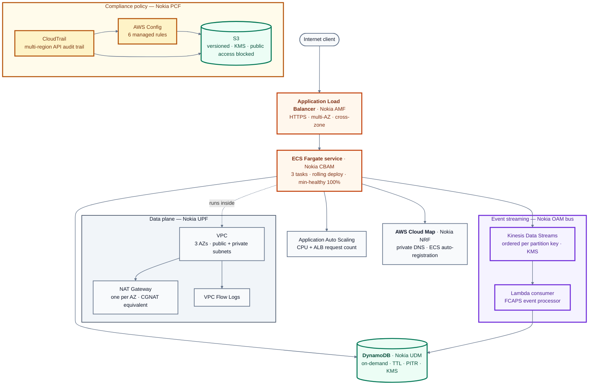

# Architecture Diagram: Nokia 5G Core → AWS

GitHub renders Mermaid diagrams natively. The diagram below shows every Nokia 5G network function mapped to its AWS equivalent, connected with accurate service relationships.

---

## Full architecture

```mermaid
flowchart TD
  Client(["Internet client"])
  ALB["<b>Application Load Balancer</b> · Nokia AMF<br/>HTTPS · multi-AZ · cross-zone"]
  ECS["<b>ECS Fargate service</b> · Nokia CBAM<br/>3 tasks · rolling deploy · min-healthy 100%"]
  ASG["Application Auto Scaling<br/>CPU + ALB request count"]
  CloudMap["<b>AWS Cloud Map</b> · Nokia NRF<br/>private DNS · ECS auto-registration"]
  DDB[("<b>DynamoDB</b> · Nokia UDM<br/>on-demand · TTL · PITR · KMS")]

  subgraph DataPlane["Data plane — Nokia UPF"]
    VPC["VPC<br/>3 AZs · public + private subnets"]
    NAT["NAT Gateway<br/>one per AZ · CGNAT equivalent"]
    FlowLogs["VPC Flow Logs"]
  end

  subgraph EventBus["Event streaming — Nokia OAM bus"]
    Kinesis["Kinesis Data Streams<br/>ordered per partition key · KMS"]
    Lambda["Lambda consumer<br/>FCAPS event processor"]
  end

  subgraph Policy["Compliance policy — Nokia PCF"]
    Config["AWS Config<br/>6 managed rules"]
    CloudTrail["CloudTrail<br/>multi-region API audit trail"]
    S3[("S3<br/>versioned · KMS · public access blocked")]
  end

  Client --> ALB --> ECS
  ECS --> ASG
  ECS --> DDB
  ECS --> CloudMap
  ECS --> Kinesis --> Lambda --> DDB
  VPC --> NAT
  VPC --> FlowLogs
  ECS -.->|"runs inside"| VPC
  CloudTrail --> Config
  Config --> S3
  CloudTrail --> S3

    linkStyle default stroke:#64748b,stroke-width:1.5px
    classDef default fill:#f8fafc,stroke:#64748b,stroke-width:2px,color:#0f172a
    classDef aws   fill:#fff7ed,stroke:#c2410c,stroke-width:3px,color:#7c2d12
    classDef ci    fill:#f5f3ff,stroke:#6d28d9,stroke-width:3px,color:#4c1d95
    classDef data  fill:#ecfdf5,stroke:#047857,stroke-width:3px,color:#064e3b
    classDef warn  fill:#fef3c7,stroke:#b45309,stroke-width:3px,color:#78350f
    class ALB,ECS aws
    class DDB,S3 data
    class Kinesis,Lambda ci
    class Config,CloudTrail warn
    style DataPlane fill:#f1f5f9,stroke:#475569,stroke-width:2px,color:#0f172a
    style EventBus fill:#f5f3ff,stroke:#6d28d9,stroke-width:3px,color:#4c1d95
    style Policy fill:#fffbeb,stroke:#b45309,stroke-width:3px,color:#78350f
```

---

## Component mapping legend

| Subgraph colour | Nokia component | AWS service | Why the mapping is exact |
|---|---|---|---|
| Entry | AMF — first control-plane entry, auth delegation, routing | ALB | Both terminate external connections at L7 and route to internal services |
| Data plane | UPF — packet forwarding, CGNAT, QoS enforcement | VPC + NAT Gateway + Flow Logs | Both are the data-plane layer: routing, address translation, traffic logging |
| Orchestration | CBAM — CNF lifecycle (deploy, scale, heal, upgrade) | ECS Fargate + Auto Scaling | Both manage container lifecycle: rolling deploys, HPA, health-check-driven healing |
| Event streaming | OAM event bus — FCAPS events, ordered per subscriber | Kinesis Data Streams + Lambda | Both provide ordered, persistent, high-throughput event streaming with consumer decoupling |
| Subscriber store | UDM — subscriber profiles, session context, auth data | DynamoDB | Both: low-latency reads, HA, stateless NFs/tasks read context from here on restart |
| Service discovery | NRF — NF registration + discovery via Nnrf API | AWS Cloud Map | Both: central registry, health-check-driven deregistration, DNS-based discovery |
| Compliance policy | PCF — PCC rules, gating decisions, policy enforcement | AWS Config + CloudTrail | Both enforce runtime compliance rules across all components and log violations |

---

## Data flow: request lifecycle

1. **Client → ALB** — HTTPS termination at L7 (Nokia: AMF N2 termination)
2. **ALB → ECS Fargate** — path-based routing to a healthy task (Nokia: AMF → SMF routing)
3. **ECS → DynamoDB** — read/write session state (Nokia: SMF → UDM subscriber data)
4. **ECS → Kinesis** — publish operational events (Nokia: UPF/SMF → OAM event bus)
5. **Kinesis → Lambda** — consume and process FCAPS events (Nokia: CHF/NetAct consuming OAM)
6. **ECS → Cloud Map** — service registration on task startup (Nokia: NF → NRF registration)
7. **CloudTrail → Config** — API events feed compliance evaluation (Nokia: OAM → PCF policy input)
8. **Config, CloudTrail → S3** — findings and audit trail persisted to versioned, encrypted buckets

---

*All Nokia component definitions sourced from 3GPP TS 23.501 and Nokia CloudBand documentation.*
*All AWS service descriptions sourced from AWS official documentation.*
